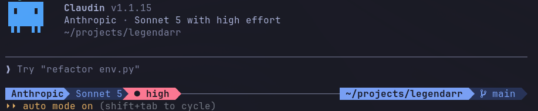

<h1 align="center"> Claudin</h1>

<p align="center">
  
  <a href="https://github.com/claudio-labs/claudin/actions/workflows/pr-checks.yml"></a>
  
  <a href="LICENSE"></a>
  <a href="https://github.com/claudio-labs/claudin/issues"></a>
  <a href="https://github.com/claudio-labs/claudin/pulls"></a>
  <a href="SECURITY.md"></a>
</p>

**One coding agent CLI. Any LLM.**

Claudin brings a terminal-first agentic workflow — bash, file tools, grep, glob, agents, MCP, slash commands, streaming — to any model provider. Switch between OpenAI, Gemini, DeepSeek, Ollama, Mistral, GitHub Copilot, Bedrock, Vertex, and 200+ OpenAI-compatible endpoints without changing your workflow.

Claudin began as a fork of Anthropic's [Claude Code](https://github.com/anthropics/claude-code) and keeps its agent loop, tool surface, and configuration format. It is developed and released independently, and is not affiliated with or endorsed by Anthropic.

---

## Install

```bash
npm install -g @claudiolabs/claudin@latest
```

Runs on Linux, macOS, and Windows (x64 + arm64). Claudin installs a native
executable for your platform — `npm` downloads only the one matching package
(~68 MB), and `claudin` launches directly with no Node process in front of it
(~2× faster startup than the previous bundled build). On a platform without a
prebuilt binary, it transparently falls back to the bundled Node build (Node
22.12+ required for that path only).

**First run on macOS / Windows (unsigned binary).** The binaries are not yet
code-signed, so the OS may block the first launch:

- **macOS** (Gatekeeper "cannot be opened"): run
  `xattr -d com.apple.quarantine "$(which claudin)"` once, or approve it under
  System Settings → Privacy & Security → "Open Anyway".
- **Windows** (SmartScreen "unrecognized app"): click "More info" → "Run anyway"
  on the first launch.

### Breaking change: environment variables are now `CLAUDIN_*`

Every environment variable Claudin owns was renamed from `CLAUDE_CODE_FOO` /
`CLAUDE_FOO` to `CLAUDIN_FOO` — 156 names, with no dual reading and no
deprecation period. If you only ever set provider credentials
(`ANTHROPIC_API_KEY`, `AWS_*`, `OPENAI_*`, …) nothing changes: third-party
variables were not touched.

**What breaks is anything you wrote against the old contract.** A hook, plugin,
skill, or MCP `headersHelper` script that reads `$CLAUDE_PROJECT_DIR`,
`${CLAUDE_PLUGIN_ROOT}`, `${CLAUDE_PLUGIN_DATA}`, `${CLAUDE_SKILL_DIR}`,
`$CLAUDE_SESSION_ID`, `CLAUDE_PLUGIN_OPTION_*`, `CLAUDE_ENV_FILE`, or
`CLAUDE_CODE_MCP_SERVER_NAME` / `_URL` stops receiving a value until you rename
it — the substitution simply no longer fires, so the failure is a silently
empty variable rather than an error. Swap the prefix and it works again.

Names that something *outside* Claudin sets are deliberately unchanged, so the
Claude Agent SDK, the IDE extension, and managed deployments keep working:
`CLAUDE_CODE_ENTRYPOINT`, `CLAUDE_CODE_OAUTH_TOKEN`, the `CLAUDE_AGENT_SDK_*`
family, and 15 more. `scripts/migrations/env-rename-map.json` is the full mapping, bucket
by bucket, with the reason for every name that stayed.

## Quick Start

```bash
claudin
```

On first run, Claudin opens the `/provider` wizard — pick a preset, sign in or paste a key, and start working. No environment variables required. Credentials are saved as profiles under `~/.claudin/`, so you can keep several providers configured and switch between them anytime.

## What Claudin adds

The agent loop is inherited. These are not:

- **Any provider, managed from inside the REPL.** `/provider` keeps profiles for every backend — API key, OAuth web sign-in, or a local endpoint — under `~/.claudin/`. Switching provider, model, or reasoning effort never leaves the session, and no environment variable is required to start.
- **Tools that answer instead of paging.** `Git`, `Build`, `Typecheck` and `RunTests` run the underlying command and hand back the diagnostics with `file:line`, not the log around them. `Typecheck` goes further and reports only what your change *added*, against a backlog recorded per commit.
- **`/diff`** — a reviewer for the working tree, with multi-repo and worktree discovery.
- **Workflows and a self-hosted background agent** — multi-phase agent runs in isolated worktrees, and a trigger-driven runner that opens its own pull request.
- **Zero telemetry.** Analytics, GrowthBook, Datadog, BigQuery, and the auto-updater are replaced with no-op stubs at build time; `bun run verify:privacy` scans the bundle and fails the build if a phone-home path survives.
- **Token and cost behavior on by default** — the Bash output filter, the prompt-cache policy, the Read clip-pin, and fork-by-default sub-agents. Each carries a `CLAUDIN_*` killswitch, documented at the top of the module that implements it.

## Documentation

Full documentation lives at **[claudiolabs.ai/docs](https://www.claudiolabs.ai/docs/)**.

- [Install](https://www.claudiolabs.ai/install) — platform binaries, the Node fallback, and first run.
- [Providers](https://www.claudiolabs.ai/providers) — every preset, OAuth vs. API key, local endpoints.
- [Migrating from Claude Code](https://www.claudiolabs.ai/migrate-from-claude-code) — what carries over and what changes.
- [Configuration](https://www.claudiolabs.ai/docs/configuration) — settings, permissions, and interface options.
- [Agents](https://www.claudiolabs.ai/docs/agents) and [workflows](https://www.claudiolabs.ai/docs/workflows) — sub-agents, isolated worktrees, and the self-hosted background agent.
- [Skills](https://www.claudiolabs.ai/docs/skills), [plugins](https://www.claudiolabs.ai/docs/plugins), [MCP](https://www.claudiolabs.ai/docs/mcp), and [hooks](https://www.claudiolabs.ai/docs/hooks) — extend the agent.
- [Automation](https://www.claudiolabs.ai/docs/automation) — headless `claudin -p` for pipes and CI.
- [Cache policy](https://www.claudiolabs.ai/docs/cache-policy) and the [bash output filter](https://www.claudiolabs.ai/docs/bash-output-filter) — the token and cost behavior that ships on by default.

In this repository: [docs/playbook.md](docs/playbook.md) — a day-to-day guide to
running Claudin against a local model with Ollama.

Run `/help` inside the app for the full command list.

## Build from Source

```bash
bun install && bun run build && node dist/cli.mjs
```

### Dev binary (`claudindev`)

Local checkouts only produce a dev binary — the stable release is never
built locally, it comes from npm. To work with both:

```bash
npm install -g @claudiolabs/claudin@latest   # stable release → `claudin`
bun run link:dev                              # local build    → `claudindev`
```

`link:dev` symlinks `<repo>/bin/claudin` as `claudindev` in `~/.bun/bin` or
`~/.local/bin`, so `claudin` stays pinned to the published release while
`claudindev` picks up every `bun run build` from your checkout.

See [CONTRIBUTING.md](CONTRIBUTING.md) for the build system, feature flags, and pre-PR checks.

## Screenshot

Launching Claudin shows the active provider, model, and effort in the banner and in
the footer, so you can tell at a glance which build and profile you are on:



## License

Released under the [MIT License](LICENSE). Claudin is an independent project and is not affiliated with or endorsed by any model provider.
